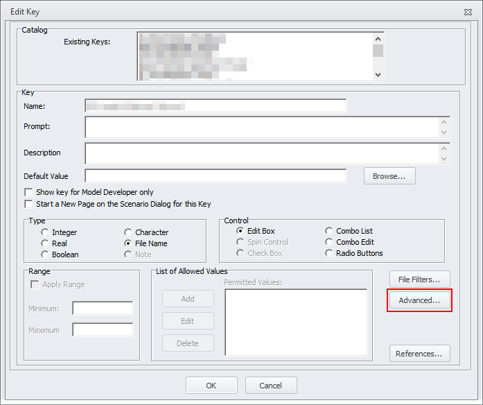
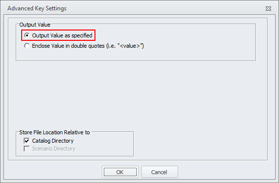

# tmfs-accident-processing
Python code for undertaking accident analysis on TMfS outputs

## Usage
In many circumstances, the executable version of this application should be used - in particular, using this directly within Cube allows for accident analysis via `PILOT`, rather than the hassle of setting up a Python environment for use as a Custom User Program in Cube.

Calling the executable from the command line with the `-h` / `--help` flag will display a short help message, shown below:

```text
usage: tmfs-accident-processing_v0.0.1.exe [-h] rates_workbook network_file year log_file output_csv

Apply accident calculations for a single network.

positional arguments:
  rates_workbook  Accident rates workbook
  network_file    Network file to process
  year            Year of the network
  log_file        Output log file for the process
  output_csv      Output CSV file for the results

optional arguments:
  -h, --help      show this help message and exit
```

## Input files

### `rates_workbook`
This should be an excel workbook containing the accident rates to be applied, with relevant requirements on sheet and column names met. **The full path (including drive and folders) should be provided.**

_Example workbook coming soon_

#### General format
Inputs should be in "long" formats, with columns as specified below. Column headers should be contained in **row 2** of the Excel sheet - this allows for any commentary / sources to be written in row 1, which will be ignored by the process.

##### Column definitions
Some columns are used in multiple worksheets. Their definitions are provided here to avoid repetition:
- `Accident Type` - also referred to (somewhat confusingly) as "Road Type" in TAG documents, this is a categorisation of roads according to their characteristics (e.g. S2).
- `Road Type` - the type of road, broadly in terms of its location. This should be one of:
  - `Motorway`
  - `Urban` (speed limit < 40mph)
  - `Rural` (speed limit > 40mph)

#### Required sheets
The sheets detailed below are mandatory for running the process, and should be named **exactly as listed here**.

##### `Link Class Correspondence`
This sheet details the correspondence between link classes used in TMfS and the "accident types" used by TAG.

Columns required are as follows:
- `TMfS Link Class` - should directly correspond to the `LINK_CLASS` attribute used in the Cube network
- `Accident Type`

##### `Accident Rates`
This sheet contains the accident rates to be used and their corresponding beta factors. One row should be present for each combination of Accident Type and Road Type in use.

Columns required are as follows:
- `Accident Type`
- `Road Type`
- `Pia/mvkm` - number of personal injury accidents per million vehicle kilometres
- `Beta` - adjustment factor to be applied to the accident rate (in line with TAG)

##### `Casualty Rates`
This sheet details the number of casualties of each classification. One row should be present for each combination of Accident Type and Road Type in use.

Columns required are as follows:
- `Accident Type`
- `Road Type`
- `Fatal` - the number of fatal casualties per accident
- `Serious` - the number of serious casualties per accident
- `Slight` - the number of slight casualties per accident

##### `Casualty Beta Factors`
This sheet contains the adjustment factors to be applied to casualty rates. One row should be present for each combination of Accident Type and Road Type in use.

Columns required are as follows:
- `Accident Type`
- `Road Type`
- `Fatal` - beta factor for fatal casualties
- `Serious` - beta factor for serious casualties
- `Slight` - beta factor for slight casualties

##### `Accident Proportions`
This sheet details what proportion of PIA accidents correspond to each classification. One row should be present for each combination of Accident Type and Road Type in use.. Note that each row should sum to 1.

Columns required are as follows:
- `Accident Type`
- `Road Type`
- `Fatal` - proportion of accidents classified as fatal
- `Serious` - proportion of accidents classified as serious
- `Slight` - proportion of accidents classified as slight


#### Optional sheets
The following sheets are optional, and allow for variations in processing methodology

##### `Region Equivalence`
This sheet allows for the disaggregation of accident calculations into different regions based on a link selection. This could involve disaggregating the entire network, or may be used as a way of selecting one or more specific areas. Any links not included within this list which are otherwise subject to accident calculations will be assigned a region of `UNKNOWN REGION`. This should allow for easy identification of issues if links are omitted from a whole-network disaggregation.

Columns required are as follows:
- `A` - the a-node of the link
- `B` - the b-node of the link
- `Region Name` - the name of the region to be associated with that link

### `network_file`
This network should be an exported DBF of the network, with a column called `ANN_V` containing the annualised vehicle volume for every link. **The full path (including drive and folders) should be provided.**

### `year`
The year the provided network corresponds to. Should be in 4-digit form, e.g. `2021`, and should be passed as a number, not a string (be careful with Cube keys!)

## Output files

### `log_file`
The process writes some text outputs to a text-based log file for records and potentially debugging - provide a file path for the logs to go into. **The full path (including drive and folders) should be provided.**

### `csv_file`
The main output of the process is a CSV file containing the accident and casualty numbers calculated for the provided parameters - provide a file path for the output to go into. **The full path (including drive and folders) should be provided.**

## Example `PILOT` script
```shell
*"{CATALOG_DIR}\executables\tmfs-accident-processing_v0.0.1.exe" "{Accident Rates Workbook}" "{SCENARIO_DIR}\{Scenario_ShortName} Annualised Network.dbf" {Year} "{SCENARIO_DIR}\Analysis.log" "{SCENARIO_DIR}\{Scenario_ShortName}_Accident Summary.csv"
```

This assumes:
1. The executable is stored alongside the catalog file in a folder called `Executables`
2. The required network file has been created (likely in a `NETWORK` box in the previous step) and saved as `{SCENARIO_DIR}\{Scenario_ShortName} Annualised Network.dbf`
3. `Year` is a catalog key, with type set to integer
4. `Accident Rates Workbook` is a catalog key (likely Filename type, but could be string), set to "Output Value as specified", i.e.:


